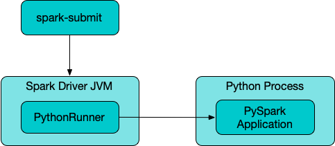

# PythonRunner

`PythonRunner` is a [command-line application](#main) to launch a separate process to run a Python application (alongside the JVM process of `PythonRunner` with Apache Spark services).

<figure markdown>
  
</figure>

`PythonRunner` can be launched using `spark-submit` shell script ([Spark Core]({{ book.spark_core }}/tools/spark-submit/)).

`PythonRunner` executes the [Python executable](#pythonExec) (with the PySpark application and arguments) as a subprocess that is expected to connect back to the JVM to access Spark services.

??? note "Uh-oh, there are two PythonRunners 🙄"
    This page is about `org.apache.spark.deploy.PythonRunner` while there is another [PythonRunner](runners/PythonRunner.md).

## Arguments

`PythonRunner` accepts the following command-line arguments (in that order):

1. Main python file (`pythonFile`)
1. Extra python files (`pyFiles`)
1. PySpark application arguments, if any

## Python Executable { #pythonExec }

`PythonRunner` determines the Python executable to launch a PySpark application with based on the following (in the order of precedence):

1. [spark.pyspark.driver.python](configuration-properties/index.md#spark.pyspark.driver.python) configuration property
1. [spark.pyspark.python](configuration-properties/index.md#spark.pyspark.python) configuration property
1. [PYSPARK_DRIVER_PYTHON](environment-variables.md#PYSPARK_DRIVER_PYTHON) environment variable
1. [PYSPARK_PYTHON](environment-variables.md#PYSPARK_PYTHON) environment variable
1. `python3`

## Environment Variables

`PythonRunner` defines the following environment variables to configure the PySpark application's execution environment.

Environment Variable | Value
---------------------|---------
 `PYTHONPATH` | Comma-separated list of local paths with formatted `pyFiles` and [sparkPythonPath](PythonUtils.md#sparkPythonPath), followed by the existing `PYTHONPATH`
 `PYTHONUNBUFFERED` | `YES`
 [PYSPARK_GATEWAY_PORT](environment-variables.md#PYSPARK_GATEWAY_PORT) | The [listening port](Py4JServer.md#getListeningPort) of the started `Py4JServer`
 [PYSPARK_GATEWAY_SECRET](environment-variables.md#PYSPARK_GATEWAY_SECRET) | The [secret](Py4JServer.md#secret) of the started `Py4JServer`
 `PYSPARK_PYTHON` | [spark.pyspark.python](configuration-properties/index.md#spark.pyspark.python) if defined
 `PYTHONHASHSEED` | `PYTHONHASHSEED` env var if defined
 `OMP_NUM_THREADS` | `spark.driver.cores` (unless defined for Spark on k8s, YARN and Mesos)
 `SPARK_REMOTE` | `spark.remote` if defined

## Launching Application { #main }

```scala
main(
  args: Array[String]): Unit
```

`main` takes the [arguments](#arguments) (from the given `args`).

`main` determines the [Python executable](#pythonExec) to launch the PySpark application (based on configuration properties and environment variables).

`main` creates a [Py4JServer](Py4JServer.md) that is immediately [started](Py4JServer.md#start) (on a daemon **py4j-gateway-init** thread). `main` waits until the `Py4JServer` has started.

`main` starts a Python process using the [Python executable](#pythonExec) and the [environment variables](#environment-variables).

`main` pauses itself and waits for the Python process to finish. Once it happens, `main` requests the `Py4JServer` to [shutdown](Py4JServer.md#shutdown).

## Demo

[Demo: Executing PySpark Applications Using spark-submit](demo/executing-pyspark-applications-using-spark-submit.md)
