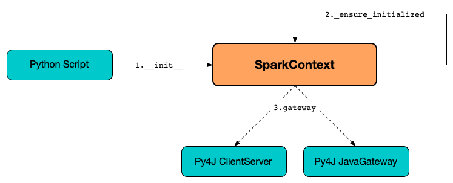

# SparkContext



## Creating Instance

`SparkContext` takes the following to be created:

* <span id="master"> Master URL (default: `None`)
* <span id="appName"> Application Name (default: `None`)
* <span id="sparkHome"> Spark Home (default: `None`)
* <span id="pyFiles"> Py Files (default: `None`)
* <span id="environment"> Environment (default: `None`)
* <span id="batchSize"> Batch Size (default: `0`)
* <span id="serializer"> `PickleSerializer`
* <span id="conf"> `SparkConf` (default: `None`)
* <span id="gateway"> Gateway (default: `None`)
* <span id="jsc"> Corresponding `SparkContext` on JVM (default: `None`)
* <span id="profiler_cls"> `BasicProfiler`

While being created, `SparkContext` [_ensure_initialized](#_ensure_initialized) (with the [gateway](#gateway) and the [conf](#conf)) followed by [_do_init](#_do_init).

## Demo

```python
from pyspark import SparkContext
```

## <span id="_gateway"> JavaGateway

`SparkContext` defines `_gateway` property for a `JavaGateway` that is given or launched when [_ensure_initialized](#_ensure_initialized).

## <span id="_jvm"> JVMView

`SparkContext` defines `_jvm` property for a `JVMView` ([py4j]({{ py4j.doc }}/py4j_java_gateway.html#jvmview)) to access to the Java Virtual Machine of the [JavaGateway](#_gateway).

## <span id="_ensure_initialized"> _ensure_initialized

```python
_ensure_initialized(
  cls, instance=None, gateway=None, conf=None)
```

`_ensure_initialized` is a `@classmethod`.

`_ensure_initialized` takes the given [gateway](#gateway) or [launch_gateway](pyspark/java_gateway.md#launch_gateway).

`_ensure_initialized`...FIXME

`_ensure_initialized` is used when:

* `SparkContext` is [created](#creating-instance) and `setSystemProperty`
* [shell.py](pyspark/shell.md) is launched

## <span id="_do_init"> _do_init

```python
_do_init(
  self, master, appName, sparkHome,
  pyFiles, environment, batchSize, serializer,
  conf, jsc, profiler_cls)
```

`_do_init`...FIXME
